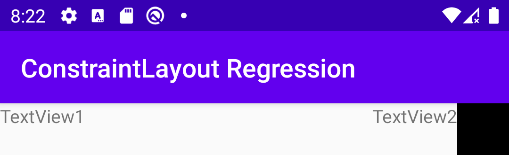
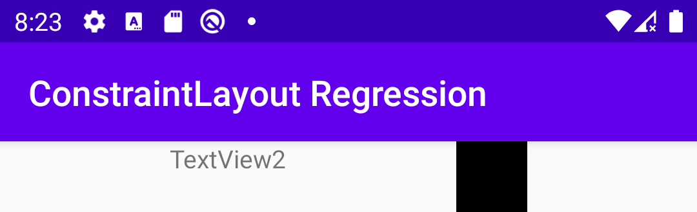

# ConstraintLayout Regression

This repository contains a bare-bones Android application which contains a super simple [layout file](app/src/main/res/layout/activity_main.xml) that demonstrates a change in behaviour from version `2.0.0-beta4` of the ConstraintLayout library to versions `2.0.0-beta5` and `2.0.0-beta6`.
The change in behaviour appears to me to be a bug and not an intended change.

The [layout file](app/src/main/res/layout/activity_main.xml) defines three views positioned left to right, as follows:
1. A `TextView` with width `0dp` which will expand to fill the remaining space after the other views are laid out.
2. A `TextView` with width `wrap_content` which will tightly wrap its content.
3. An `ImageView` with fixed width.

With version `2.0.0-beta4` of the ConstraintLayout library, the layout is rendered as follows:

However, with versions `2.0.0-beta5` and `2.0.0-beta6` of the ConstraintLayout library, the layout is rendered as follows:

**Edit:** See [here](https://issuetracker.google.com/issues/158232458) for the bug report in IssueTracker and the suggested workaround.